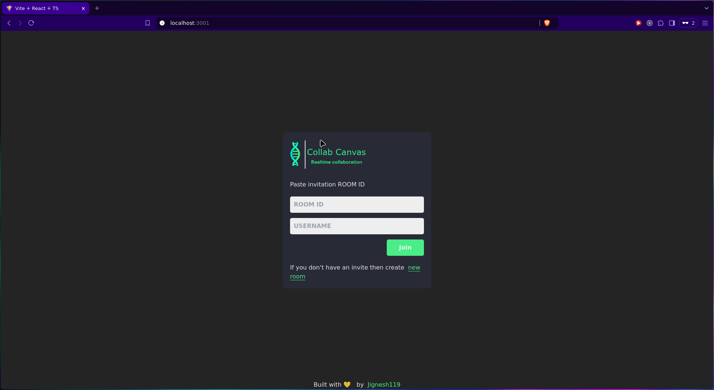

# CollabCanvas

Its a collaborative drawing board to unleash your inner picasso. Its inspired from skribbl.io.
Users in the same room can simultaneously draw and see updates from others in realtime.

> its going to be a part of my another big project

## Demo




## Features

- **Real-Time Collaboration**: multiple users can draw together on same canvas
- **Room-Based Sessions**: create or join rooms with a unique room ID.
- **Dynamic Drawing Tools**: supports various colors & tools like clear tool, copying roomId.
- **TypeScript-Powered**: used strong typing for code reliability & linting.

## Tech Stack

- **Reactjs**: For building the ui.
- **Typescript**: for type safety and better dev exp.
- **Node.js**: for the backend server for real-time communication.
- **WebSockets**: for two-way synchronization across users.
- **Canvas API**: for clean, responsive drawing.

### Installation

1. Clone the repository:

   ```bash
   git clone https://github.com/jignesh119/CollabCanvas.git
   cd CollabCanvas
   ```

2. Install dependencies:

   ```bash
   npm install
   ```

3. Start the server:

   ```bash
   npm run start
   ```

4. Open your browser and navigate to `http://localhost:3001` to start collaborating!

## Usage

### Home Page (`/`)

- Enter your name and a room ID to create or join a room

### Canvas Page (`/canvas/[roomId]`)

- The shared drawing space where participants can:
  - Draw and see updates
  - Invite others by sharing the room ID.

## Project Structure

```bash
src/
├── components/
│   ├── canvas.tsx         # Canvas logic
│   ├── canvasPage.tsx     # Main page for drawing board
│   ├── client.tsx
│   ├── home.tsx
├── hooks/
│   └── useDraw.ts         # hook for drawing on canvas
├── utils/
│   └── drawLine.ts        # Utility to handle line drawing logic
├── types/
│   └── typing.d.ts
├── io.ts                  # WebSocket connection setup
├── App.tsx
server.js                  # Node.js server logic for WebSocket
```

## Contributing

Contributions are always welcome! Feel free to fork the repository, create a new branch, and submit a pull request with your enhancements or fixes.
